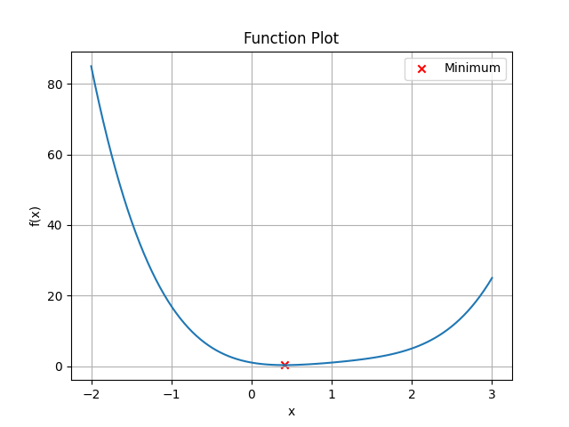
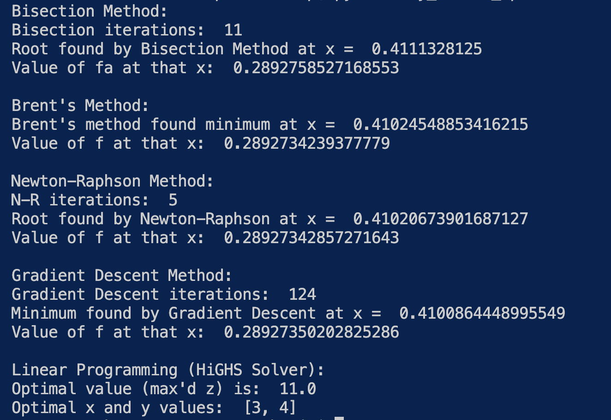

# Welcome to My Convex Optimization
***

## Task
In this project, the goal is to explore convex optimization techniques by finding the minimum of a convex function and solving a linear programming problem. The main challenges include implementing numerical methods to efficiently find the minima, comparing different optimization techniques, and solving constrained optimization using the Simplex algorithm.

## Description
I solved the problem by implementing several core numerical optimization algorithms:
- Function plotting to visualize the convexity of the function
- Bisection method to find the root of the derivative (where slope = 0, i.e. the minimum)
- Newton-Raphson method for faster root finding using second-order derivative information
- Gradient Descent to simulate iterative descent towards the minimum
- Linear programming (Highs solver) to maximize a linear objective function under constraints. Each method was validated by comparing its results to SciPy's minimize-scalar using Brent's method, a robust built-in scalar optimizer. Brent's result served as a benchmark for accuracy.

Plot:

</br>

## Installation
To run this project, have Python 3 installed and libraries numpy, matplotlib, scipy:
```
pip install -r requirements.txt
```


## Usage
Run the Python file:
```
python3 my_convex_optimization.py
```
The script will:
- Plot the function
- Find and print the minima using different methods
- Solve the linear programming problem
- Plot the function and mark the minimum for visual verification

## Output, Results, Observations

</br>
The output confirms that all methods (Bisection, Newton-Raphson, Gradient Descent, and Brent's method) converge to the same minimum of the convex function. I talso shows that the linear programming problem is solved correcty using the HiGHS solver.

### The Core Team
Anthea Ip
- Aspiring data engineer and backend developer exploring ML foundations. 
- Powered by convex functions, gradient descent, and curiousity