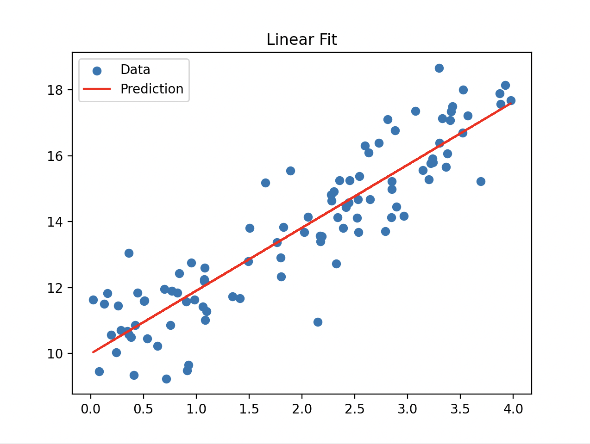
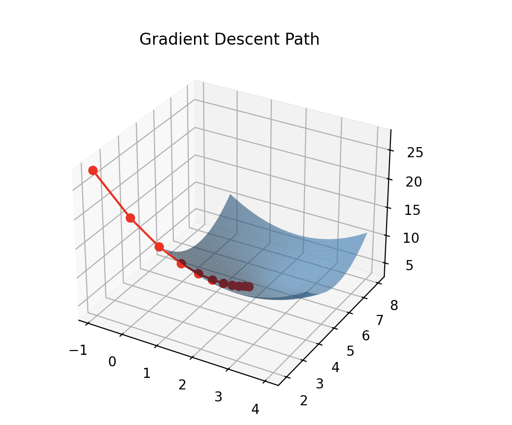

# Welcome to My Linear Regression

## Task
The task is to build a simple linear regression model to predict continuous outcomes based on one feature. The challenge is to find the best fitting line using two different techniques:
- The Closed-Form Solution (Normal Equation)
- Gradient Descent Optimization
The goal is to minimize the Mean Squared Error (MSE) between the data and prediction model.


## Description
This project walks through building a simple linear regression system without using scikit-learn and other high-level libraries. It includes:

- Define a linear hypothesis function (h(x, θ))
- Implement a cost function (MSE)
- Solve for optimial weights (θ) using:
  - A closed-form solver using the Normal Equation (Least Squares)
  - An iterative solver using batch Gradient Descent
- Visualize 
  - The linear fit to noisy data
  - The gradient descent trajectory on a convex surface


Linear:

</br>

Gradient Descent:

</br>


## Installation
Python3 and NumPy
```
pip install numpy matplotlib
```
Clone this repo and drun the Python scripts directly


## Usage
Run the script to train the model and view results:
```
python3 my_linear_regression.py
```
Plots will be:
- Linear regression with noisy data
- Gradient descent progress on a convex cost function


### The Core Team
Anthea Ip
- Aspiring data engineer and backend developer exploring ML foundations. 
- Powered by linear algebra, NumPy, and curiousity